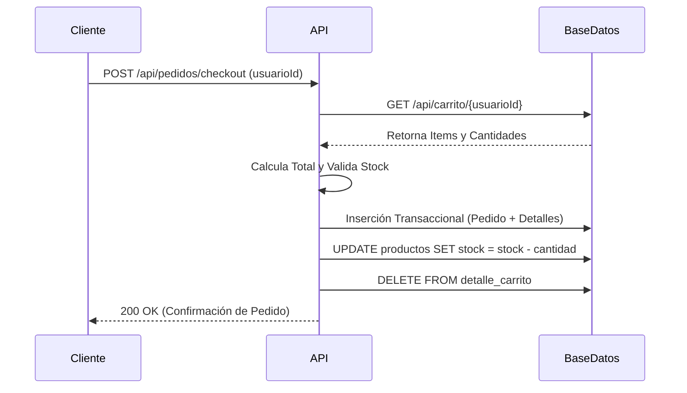

```markdown
# 🛒 E-Commerce REST API - Core Backend

API RESTful desarrollada para la gestión integral de una plataforma de comercio electrónico. Orquesta toda la lógica de negocio, incluyendo catálogo de productos, carritos de compra, pasarela de checkout transaccional, logística de envíos y perfiles de usuario.

## 🛠️ Stack Tecnológico

| Capa | Tecnología | Propósito |
|-----------|---------|----------|
| **Core Framework** | Spring Boot 3.5.7 (Java 17) | Arquitectura base y contenedores IoC |
| **Persistencia** | Spring Data JPA / Hibernate | ORM y manejo de transacciones |
| **Base de Datos** | PostgreSQL (Supabase) | Almacenamiento relacional en la nube |
| **Documentación** | SpringDoc OpenAPI | Generación de Swagger UI |
| **Build Tool** | Maven | Gestión de dependencias |

## ⚙️ Arquitectura y Flujo Transaccional (Checkout)

El sistema maneja un flujo de checkout seguro, calculando totales en el backend para evitar manipulaciones del lado del cliente, y actualizando el inventario en tiempo real.



## 🌐 Endpoints Principales y Contratos (Payloads)

*La documentación completa e interactiva está disponible vía Swagger UI en `/swagger-ui/index.html` al ejecutar el proyecto localmente.*

### Procesar Checkout (Crear Pedido)
Endpoint crítico que transforma el carrito activo de un usuario en un pedido formal.
- **Ruta:** `POST /api/pedidos/checkout`
- **Request Body:**
```json
{
  "usuarioId": 1,
  "metodoPagoId": 2,
  "domicilioId": 5
}
```
- **Response (200 OK):**
```json
{
  "status": "success",
  "mensaje": "Pedido generado exitosamente",
  "pedidoId": 1042,
  "totalCobrado": 2450.00
}
```

## 🚀 Instalación y Despliegue Local

1. Clonar el repositorio:
```bash
git clone https://github.com/IAmezcuaDev/-E-Commerce.git
cd \-E-Commerce
```
2. Configurar credenciales de BD en `src/main/resources/application.properties`:
```properties
spring.datasource.url=jdbc:postgresql://[host-supabase]:5432/[db]
spring.datasource.username=[tu_usuario]
spring.datasource.password=[tu_password]
spring.jpa.hibernate.ddl-auto=update
```
3. Compilar y ejecutar la aplicación:
```bash
./mvnw clean install
./mvnw spring-boot:run
```

## 🚧 Deuda Técnica y Roadmap
- **Seguridad:** Implementación de Spring Security y JWT para proteger endpoints privados.
- **Optimización:** Agregar paginación y filtrado dinámico en consultas del catálogo (`ProductoController`).

---
**Desarrollado por:** Ignacio Amezcua
